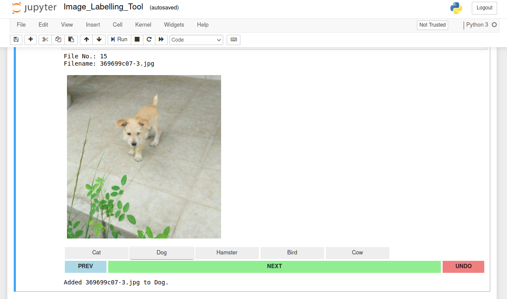
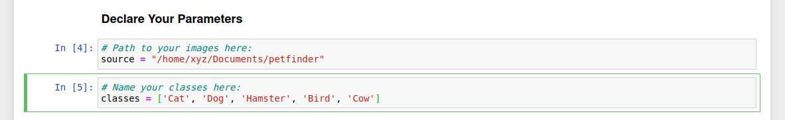

# An Image Labelling Tool
A simple image labelling tool for creating multi-label classification datasets, that works straight out of a python notebook!

This is built using IPython widgets and supports both multi-class and multi-label annotations.
     
     
      
      
 

 <i> Isn't he a good boy! </i> 

### This is fully CUSTOMiSABLE !!

Pass in your variables in **Declare Your Parameters** section of the notebook. Just the path to your images folder, and the classes it contains.

  

