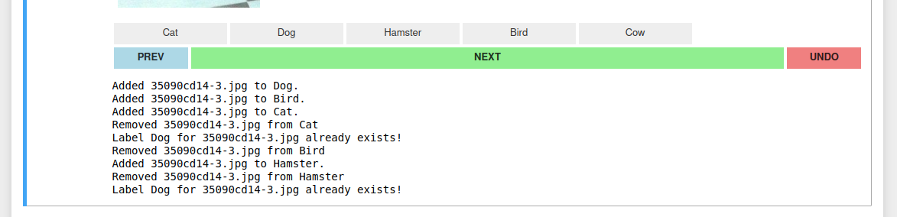

# An Image Labelling Tool
A simple image labelling tool for creating multi-label classification datasets, that works straight out of a python notebook!

This is built using IPython widgets and supports both multi-class and multi-label annotations.
     
     
      
      
 

 <i> Isn't he a good boy! </i> 

### This is fully CUSTOMiSABLE !!

Pass in your variables in **Declare Your Parameters** section of the notebook. Just the path to your images folder, and the classes it contains.

  

Then go ahead and run all the cells in the **Functional Codes** blindly (you don't really have care how it works!)

And then when you run the cell under **Start the Labelling Tool** you should get the interface shown above.

### Behaviour:
* **Class Buttons**: As per the classes you mention in your parameters, buttons will be created for each of the classes. Click on any one of them to add that image to that class. You can add one image to multiple classes as well.
* **NEXT**: Simply takes you to the next image!
* **PREV**: Simply takes you to the previous image! The labels that were already added for that image, if any, shows up below the button.
* **UNDO**: Use this to delete labels that you may have added mistakenly. For a current image, **UNDO** removes labels one by one from the last label you added. If you go to a previous image, labels will deleted in the opposite order of which they are shown. 

Clicking on a class-button adds the image to a label, and prints a prompt. If you try to add to the same label twice, it'll let you know. **UNDO** also prints a prompt showing which label was removed.

  

The **Display Counts** cell shows you the class wise counts.

The **Segregate Into Directories** will create class wise folders and copy your images there.

You can even store your labels as CSV file, with the **Create Labels CSV** section.

Happy Annotating!!
